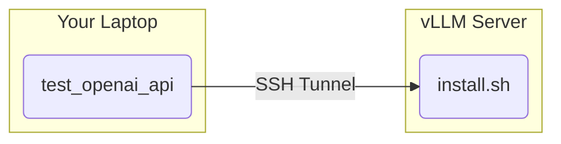

# vLLM Test

Client utilities for testing a remote vLLM OpenAI-compatible API server.

## Architecture



The server binds to `127.0.0.1` by default. Use SSH tunnel or set `VLLM_HOST_IP` to expose.

## Setup

```bash
# Create virtual environment
python3 -m venv .venv

# Activate (Windows: .venv\Scripts\activate)
source .venv/bin/activate

# Install dependencies
pip install -r requirements.txt
```

## Environment Variables

| Variable | Description | Default |
|----------|-------------|---------|
| `VLLM_HOST` | Server IP for test client | `127.0.0.1` (tunnel) |
| `VLLM_HOST_IP` | Server IP for install script | auto-detected |
| `PORT` | API port | `8000` |
| `REMOTE_HOST` | SSH tunnel remote host | edit tunnel_vllm.sh |

## Server Deployment

On the remote server:

```bash
# Optional: customize settings
export VLLM_HOST_IP="<server-ip>"   # to bind on specific interface
export PORT="8000"                   # API port
export GPU_ID="0,1,2,3,4,5,6,7"      # GPUs for tensor parallel

./install.sh
```

## Client Usage

### Via SSH Tunnel

```bash
# Start tunnel (set REMOTE_HOST in script or env)
./tunnel_vllm.sh

# Run test (connects to localhost via tunnel)
python test_openai_api.py
```

### Direct Connection

```bash
export VLLM_HOST="<server-ip>"
python test_openai_api.py --host $VLLM_HOST
```

## Files

- `install.sh` - Server deployment script (run on vLLM server)
- `tunnel_vllm.sh` - SSH tunnel setup (run on client)
- `test_openai_api.py` - API test client